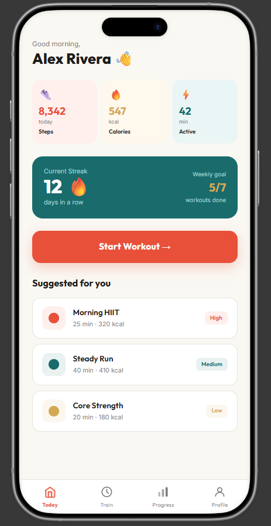
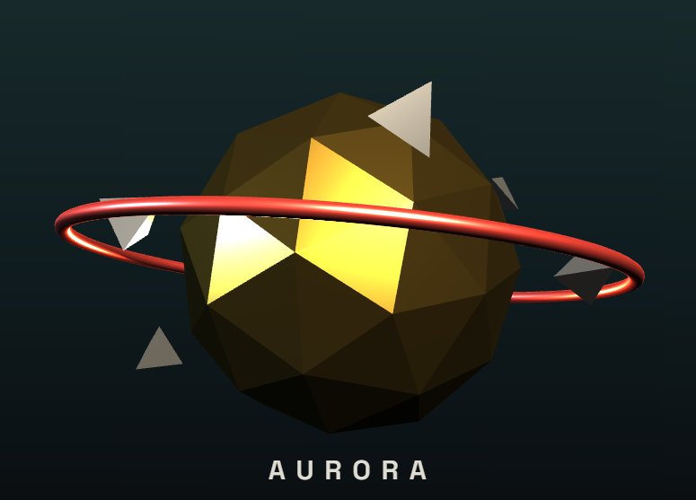

# Graphic Design Internship Projects

Two deliverables — live interactive builds, screenshots, and demo recordings.

## 1. Pulse — Fitness App UI

https://github.com/user-attachments/assets/1bef1210-7912-4679-987b-cea183e910ea

[Live demo →](https://diksha-wadekar.github.io/internship-design-projects/fitness-app-ui.html)

A 4-screen mobile fitness app (Today, Train, Progress, Profile) with working navigation and a functional workout timer with animated progress ring.

## 2. Aurora — 3D Logo Animation

https://github.com/user-attachments/assets/5b9fcb9d-68af-4774-bc8a-040bf7286b7c

[Live demo →](https://diksha-wadekar.github.io/internship-design-projects/logo-3d-animation.html)

A 3D logo mark that assembles from scattered pieces, then settles into an idle rotation with camera motion and three-point lighting.

## 1. Pulse — Fitness App UI (`fitness-app-ui.html`)
A 4-screen mobile fitness app UI (Today, Train, Progress, Profile) with working navigation and micro-interactions — tap the bottom nav to switch screens, and tap play on the Train screen to see the progress ring and timer animate.

**Tools referenced:** Figma / Adobe XD concept, built here as an interactive HTML/CSS/JS prototype.

## 2. Aurora — 3D Logo Animation (`logo-3d-animation.html`)
A 3D logo mark (faceted gem core + halo ring) that assembles from scattered pieces, settles into an idle rotation, with a drifting camera and three-point lighting (warm key, cool fill, coral rim).

**Tools:** Three.js (WebGL/3D in the browser).
